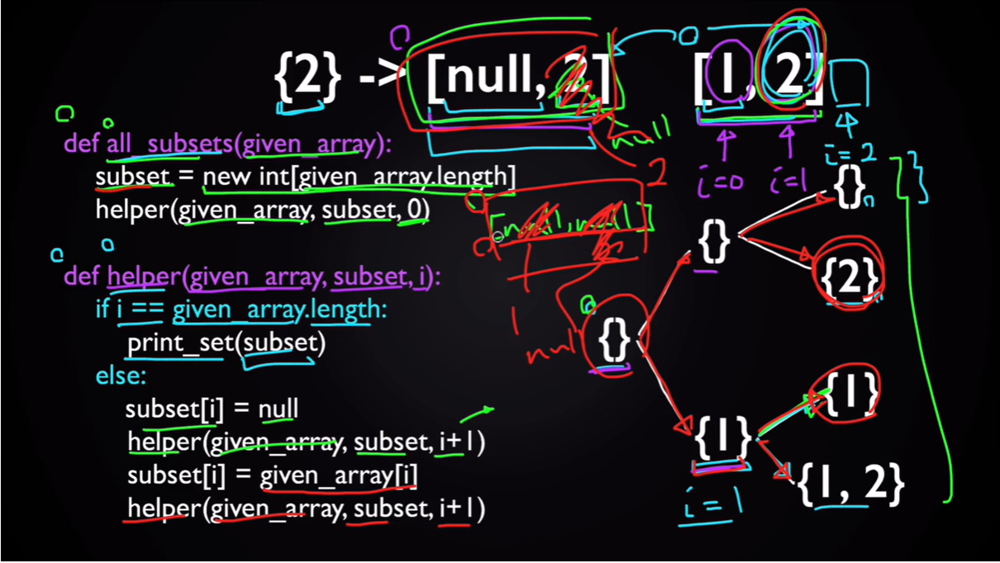
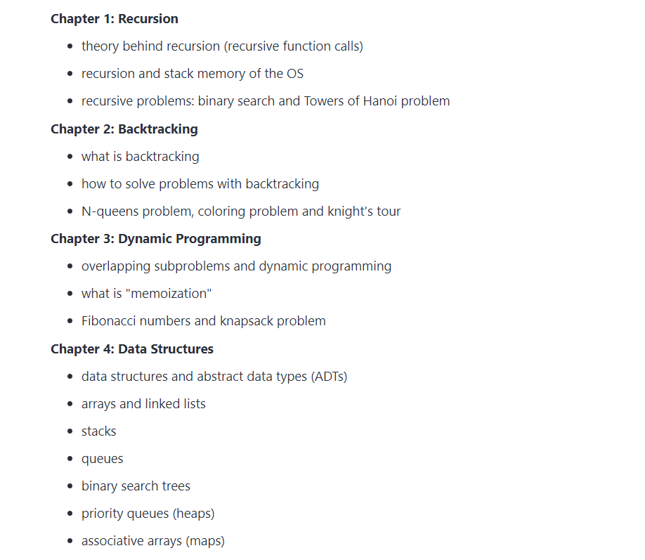

# Cplusplus

----------------------------------------------------------------

## Vector STL Functions 

- vector::begin() and vector::end()
- vector rbegin() and rend()
- vector::cbegin() and vector::cend()
- vector::crend() and vector::crbegin()
- vector::assign()
- vector::at()
- vector::back()
- vector::capacity()
- vector::clear()
- vector::push_back()
- vector::pop_back()
- vector::empty()
- vector::erase()
- vector::size()
- vector::swap()
- vector::reserve()
- vector::resize()
- vector::shrink_to_fit()
- vector::operator=
- vector::operator[]
- vector::front()
- vector::data()
- vector::emplace_back()
- vector::emplace()
- vector::max_size()
- vector::insert()

## Important Points

1. No. of digits in a number can be calculated using log. and string conversion (to_string).
2. vector<vector<int> > is a 2D vector
3. There are 2 methods of finding power set of a set. 1st one is using recursion, fing the logic of 2nd one.
  
  
  
  ## Dynamic Programming Topics 
  
  
  
  ## Hot to make a 2d vector with different no. of columns

```
// CPP program to create a 2D vector where 
// every row has 
#include <bits/stdc++.h> 
using namespace std; 

int main() 
{ 
	// size of row 
	int row = 5; 
	int colom[] = { 5, 3, 4, 2, 1 }; 

	// Create a vector of vector with size 
	// equal to row. 
	vector<vector<int> > vec(row); 

	for (int i = 0; i < row; i++) { 

		// size of column 
		int col; 
		col = colom[i]; 

		// declare the i-th row to size of column 
		vec[i] = vector<int>(col); 
		for (int j = 0; j < col; j++) 
			vec[i][j] = j + 1; 
	} 

	for (int i = 0; i < row; i++) { 
		for (int j = 0; j < vec[i].size(); j++) 
			cout << vec[i][j] << " "; 
		cout << endl; 
	} 
} 

```

Other Vector Initialization methods: https://www.geeksforgeeks.org/2d-vector-in-cpp-with-user-defined-size/

## Important Functions

- **find_if** : An iterator to the first element in the range for which pred does not return false.
If pred is false for all elements, the function returns last.

```
// find_if example
#include <iostream>     // std::cout
#include <algorithm>    // std::find_if
#include <vector>       // std::vector

bool IsOdd (int i) {
  return ((i%2)==1);
}

int main () {
  std::vector<int> myvector;

  myvector.push_back(10);
  myvector.push_back(25);
  myvector.push_back(40);
  myvector.push_back(55);

  std::vector<int>::iterator it = std::find_if (myvector.begin(), myvector.end(), IsOdd);
  std::cout << "The first odd value is " << *it << '\n';	//prints 25

  return 0;
}
```

- **map** : Maps are associative containers that store elements in a mapped fashion. Each element has a key value and a mapped value. No two mapped values can have same key values. These are python dictionaries of c++.
	
	Imp functions: Lower bound & Upper bound
	Documentation: https://www.geeksforgeeks.org/map-associative-containers-the-c-standard-template-library-stl/

## iterators & auto

 - iterator and its functions : https://www.geeksforgeeks.org/iterators-c-stl/
 - iterator vs. auto: https://andrewshitov.com/2019/11/09/iterators-vs-auto-in-cpp/
 - auto : https://www.geeksforgeeks.org/type-inference-in-c-auto-and-decltype/
